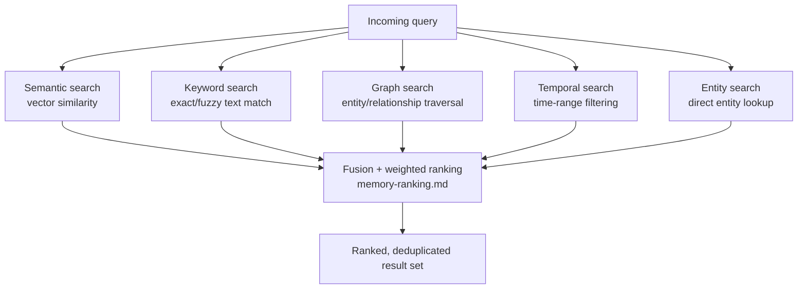

# Retrieval Engine (Retrieval Fusion Engine)

## Purpose

Defines how a single query — from the Planner's Context Builder, from a
direct user search, or from any other consumer — retrieves relevant
information across fundamentally different search mechanisms (semantic,
keyword, graph, temporal, exact, entity) and merges them into one coherent
ranked result, rather than exposing five disconnected search paths.

## Scope

Query-time retrieval and fusion logic. Ranking weights are detailed in
`memory-ranking.md`; the underlying indexes queried here are built per
`indexing.md` and `embeddings.md`.

## The fusion pipeline

## Why fusion rather than one dominant method

Each method answers a different kind of question well and others poorly:
semantic search finds conceptually related content even without matching
words, but performs poorly on exact identifiers (a specific filename);
keyword search is precise for exact matches but blind to paraphrased
queries; graph search finds relationships neither of the above can
(e.g., "what files are linked to this project") but does not rank by
textual relevance at all; temporal search narrows by recency/time-range
but says nothing about relevance within that range. Fusion exists because
no single one of these is sufficient for the range of queries NOVA needs
to answer (see `docs/01-product/use-cases.md` for the range of Phase 1
queries this must support).

## Fusion and deduplication

Results from each method are merged by underlying record identity — the
same Long-term Memory record surfaced by both semantic and keyword search
is merged into a single ranked entry rather than appearing twice, with
its final rank reflecting the combined signal from every method that
surfaced it (per the weighting model in `memory-ranking.md`).

## Query routing optimization

Not every query needs all five methods run in full every time. A query
containing an exact filename or ID is short-circuited toward keyword and
entity search first, falling back to semantic/graph search only if those
do not produce a sufficiently confident result — this is a direct
application of Principle 1 (Deterministic Before Intelligent) to
retrieval itself: an expensive semantic/vector search is not run when a
cheap exact lookup already answers the query with high confidence.

## Interaction with Context Builder

The Context Builder (`docs/05-ai/context-builder.md`) is the primary
internal consumer of this engine, converting a planning need ("what do I
know about project X") into one or more fusion queries and packing the
ranked results into the model's working context under its token budget.
The user-facing `search.md` interface is a second, more direct consumer.

## Related documents

- `memory-ranking.md` — the weighting model used at the fusion step
- `indexing.md`, `embeddings.md` — how the underlying indexes are built
- `docs/05-ai/context-builder.md` — the primary internal consumer
- `search.md` — the user-facing search interface
