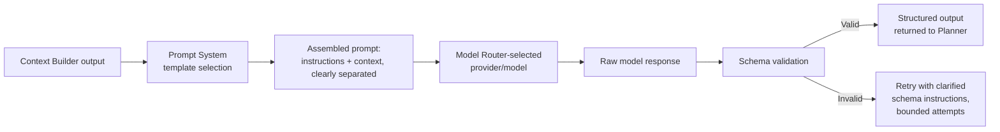

# Reasoning Engine

## Purpose

The component that actually constructs an LLM call once the Planner has
determined one is needed, and parses the model's output into a structured
form the rest of the system (Task Manager, Executor) can act on
reliably — as opposed to consuming free-form model text directly.

## Scope

LLM call construction and structured output parsing. Deciding whether a
call is needed at all is `deterministic-first.md` and
`ambiguity-resolution.md`; assembling the context passed into the call is
`context-builder.md`.

## Structured output requirement

Every Reasoning Engine call requests a structured response (a defined
schema for a plan step, a disambiguation choice, or a summary), not
free-form prose to be re-parsed heuristically downstream. This is what
allows a plan step produced by the Reasoning Engine to be handed directly
to Tool Selection and the Executor without a fragile secondary parsing
step guessing at intent from natural language.

## Call construction pipeline

## Content and instruction separation

The assembled prompt in the pipeline above strictly separates observed
content (file contents, webpage text, clipboard data — anything sourced
from Observer data) from instructions (the user's request, the system
prompt). Observed content is always presented to the model as data to
reason about, never as instructions to follow — this is the Reasoning
Engine's enforcement point for the prompt-injection defense described in
`docs/10-security/threat-model.md` (Tier 3): a webpage or file containing
adversarial text cannot cause the model to emit a plan step it was not
asked to produce, because the call construction itself marks that content
as non-instructional at the template level, not as a per-prompt
convention that could be forgotten.

## Handling malformed output

A response that fails schema validation is retried a bounded number of
times with clarified instructions; if it still fails, the step is
reported to the Planner as unresolvable by reasoning, which the Planner
treats the same as any other failed step — falling through to recovery
logic (`docs/03-runtime/planner.md`) rather than passing malformed output
further down the pipeline.

## Related documents

- `context-builder.md` — the input this engine consumes
- `prompt-system.md` — the templates used in call construction
- `docs/10-security/threat-model.md` (Tier 3) — the injection defense this
  engine enforces
- `docs/03-runtime/planner.md` — the consumer of this engine's structured
  output
